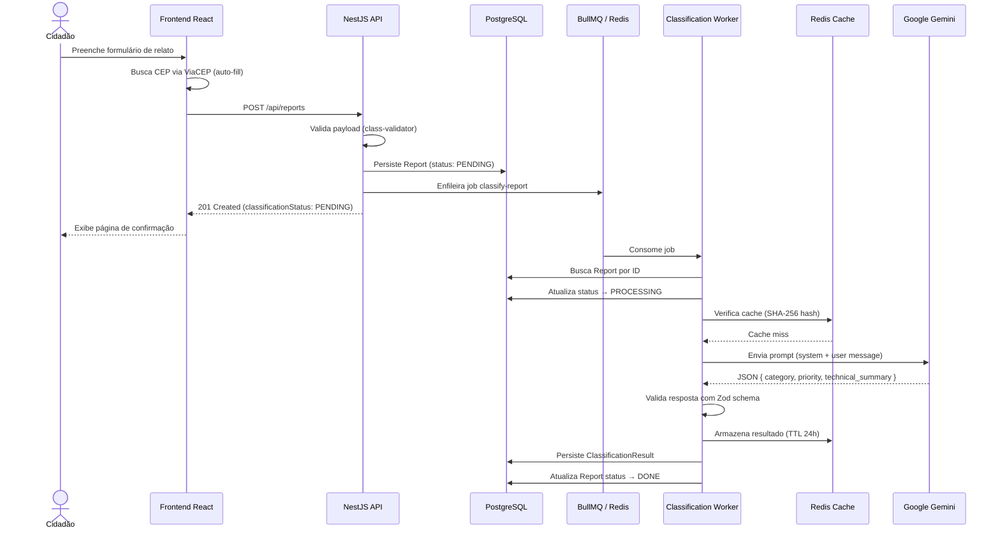
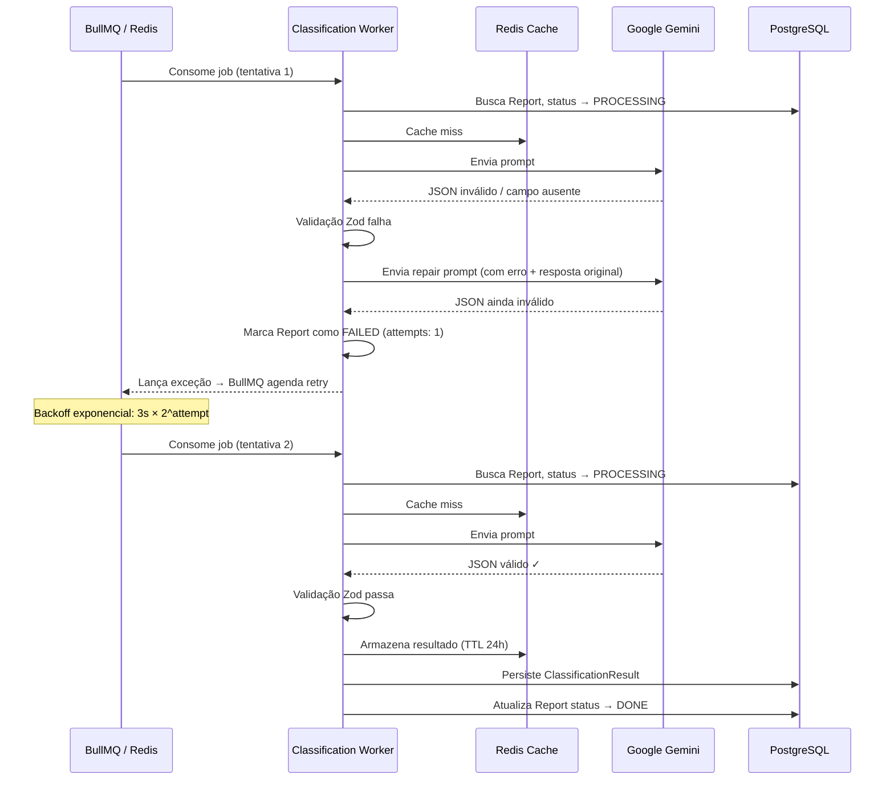

# Serviço de Triagem Municipal

> Plataforma inteligente para recebimento e classificação automática de relatos de problemas urbanos, utilizando IA generativa (Google Gemini) com processamento assíncrono via fila.

---

## Sumário

- [Visão Geral](#visão-geral)
- [Pré-requisitos](#pré-requisitos)
- [Variáveis de Ambiente](#variáveis-de-ambiente)
- [Iniciando o Projeto](#iniciando-o-projeto)
- [Resumo do Fluxo](#resumo-do-fluxo)
- [Diagrama de Sequência](#diagrama-de-sequência)
- [Arquitetura do Backend](#arquitetura-do-backend)
  - [Clean Architecture e DDD](#clean-architecture-e-ddd)
  - [Estratégia de IDs: Inteiro Interno + UUID Externo](#estratégia-de-ids-inteiro-interno--uuid-externo)
  - [Processamento Assíncrono com Fila](#processamento-assíncrono-com-fila)
  - [Integração com IA (Google Gemini)](#integração-com-ia-google-gemini)
  - [Cache de Classificação](#cache-de-classificação)
  - [Testes Automatizados](#testes-automatizados)
- [API — Endpoints](#api--endpoints)
- [Estrutura de Pastas](#estrutura-de-pastas)
- [Convenção de Idioma](#convenção-de-idioma)
- [Documentação Complementar](#documentação-complementar)

---

## Visão Geral

O **Serviço de Triagem Municipal** é um sistema para gestão de relatos urbanos. Cidadãos submetem relatos (buracos, iluminação, saneamento, etc.) por meio de um formulário web. O backend recebe, valida e persiste o relato, enfileirando-o automaticamente para classificação por IA. Um worker assíncrono processa a fila, envia o relato ao Google Gemini (com prompt estruturado, anti-alucinação e JSON schema forçado), e armazena o resultado (categoria, prioridade e resumo técnico). Todo o pipeline opera com retentativas exponenciais, cache por hash SHA-256 e idempotência, garantindo resiliência sem intervenção manual.

---

## Pré-requisitos

| Dependência | Versão mínima | Propósito |
|---|---|---|
| **Node.js** | 20.x | Runtime do backend e frontend |
| **npm** | 9.x | Gerenciador de pacotes (workspaces) |
| **Docker** + **Docker Compose** | 24.x / 2.x | PostgreSQL, Redis e build de produção |
| **Chave de API do Google Gemini** | — | Classificação por IA generativa |

### Obtendo a API Key do Gemini

1. Acesse [Google AI Studio](https://aistudio.google.com/apikey).
2. Crie ou selecione um projeto Google Cloud.
3. Gere uma API Key e copie-a para a variável `GEMINI_API_KEY` no arquivo `.env`.

> **Atenção**: a API Key é **obrigatória**. Sem ela, o serviço de classificação falhará no startup (validação fail-fast via Zod).

---

## Variáveis de Ambiente

Copie `.env.example` para `.env` na raiz do projeto e preencha os valores:

```bash
cp .env.example .env
```

| Variável | Obrigatória | Default | Descrição |
|---|---|---|---|
| `PORT` | Não | `3000` | Porta do servidor HTTP |
| `DB_HOST` | Não | `postgres` | Host do PostgreSQL |
| `DB_PORT` | Não | `5432` | Porta do PostgreSQL |
| `DB_USER` | Não | `postgres` | Usuário do banco |
| `DB_PASSWORD` | Não | `postgres` | Senha do banco |
| `DB_NAME` | Não | `urban_triage` | Nome do banco de dados |
| `REDIS_HOST` | Não | `localhost` | Host do Redis |
| `REDIS_PORT` | Não | `6379` | Porta do Redis |
| `GEMINI_API_KEY` | **Sim** | — | Chave de API do Google Gemini |
| `GEMINI_MODEL` | Não | `gemini-3-flash-preview` | Modelo Gemini a utilizar |
| `GEMINI_TIMEOUT_MS` | Não | `30000` | Timeout por requisição à IA (ms) |

> Todas as variáveis são validadas no startup via schema Zod (`env.validation.ts`). Se alguma obrigatória estiver ausente ou inválida, a API imprime uma tabela de erros e encerra imediatamente.

---

## Iniciando o Projeto

### Modo Desenvolvimento (recomendado)

O script `dev.sh` executa o fluxo completo: pre-flight checks, instalação de dependências, containers Docker, backend com hot-reload e frontend:

```bash
# Na raiz do monorepo
npm run dev
```

Isso equivale a:

```bash
sh scripts/dev.sh
```

O script faz:
1. Verifica Node.js, npm e Docker instalados.
2. Copia `.env.example` → `.env` caso não exista.
3. Executa `npm install`.
4. Sobe `postgres` e `redis` via Docker Compose.
5. Aguarda PostgreSQL ficar disponível.
6. Inicia o backend com `ts-node-dev` (hot-reload).
7. Aguarda o health check do backend.
8. Inicia o frontend com `vite`.

### Modo Manual

```bash
# 1. Instalar dependências
npm install

# 2. Subir PostgreSQL e Redis
docker compose up -d postgres redis

# 3. Iniciar o backend (hot-reload)
npm run api:dev

# 4. Iniciar o frontend (em outro terminal)
npm run web:dev
```

### Docker Compose (todos os serviços)

```bash
docker compose up --build
```

Isso sobe PostgreSQL, Redis e a API em containers (build multi-stage).

### Acessos

| Serviço | URL |
|---|---|
| API | `http://localhost:3000/api` |
| Swagger UI | `http://localhost:3000/api/docs` |
| Frontend | `http://localhost:5173` |

---

## Resumo do Fluxo

O cidadão preenche um formulário no frontend informando título, descrição e endereço estruturado (com busca automática de CEP via ViaCEP). Ao submeter, o frontend envia um `POST /api/reports` para o backend. O backend valida o payload com `class-validator`, cria a entidade `Report` com seus Value Objects (título, descrição, localização), persiste no PostgreSQL via TypeORM e enfileira um job de classificação no BullMQ/Redis. O report é retornado ao client com `classificationStatus: PENDING`. Em background, um worker consome o job, envia o relato ao Google Gemini com um prompt estruturado (taxonomia de 9 categorias, regras de prioridade, anti-alucinação, segurança contra prompt injection), recebe um JSON validado por Zod schema, e persiste o resultado como `ClassificationResult`. Se a IA retornar JSON inválido, o sistema tenta um **repair prompt** uma vez antes de falhar. Falhas são reprocessadas com backoff exponencial (3 tentativas, delay de 3s × 2^n). Resultados idênticos são cacheados em Redis por 24h usando hash SHA-256 do conteúdo do relato.

---

## Diagrama de Sequência

### Cenário Feliz (Happy Path)



### Cenário de Erro (Retry com Repair Prompt)



---

## Arquitetura do Backend

### Clean Architecture e DDD

O backend segue **Clean Architecture** combinada com **Domain-Driven Design**, com a seguinte separação de camadas:

```
src/
├── domain/          → Entidades, Value Objects, exceções e interfaces de repositório
├── application/     → Use Cases, Ports (interfaces) e lógica de negócio de IA
├── infrastructure/  → Implementações concretas (TypeORM, Redis, Gemini client, BullMQ)
├── presentation/    → Controllers HTTP, DTOs com validação, filtros de exceção
└── shared/          → Configuração, logger, constantes, tokens DI
```

**Regra de dependência**: as camadas internas (`domain`, `application`) nunca importam das externas (`infrastructure`, `presentation`). A inversão de dependência é feita via interfaces (Ports) e tokens de injeção do NestJS.

**Por que Clean Architecture?**

- **Testabilidade**: a camada de domínio é pura — sem dependências de framework. Use Cases recebem Ports injetados, permitindo testes unitários com mocks/in-memory sem banco, Redis ou API de IA.
- **Flexibilidade de provider**: trocar o Gemini por outro modelo (OpenAI, Anthropic, local) exige apenas uma nova implementação de `AiClientPort`, sem alterar nenhum Use Case.
- **Evolução independente**: regras de negócio (taxonomia, prioridades, validações de domínio) evoluem sem impactar infraestrutura e vice-versa.
- **Clareza de responsabilidade**: cada camada tem um papel bem definido, facilitando onboarding e code review.

A entidade `Report` possui lifecycle methods (`startClassification()`, `completeClassification()`, `failClassification()`) que encapsulam as transições de estado, garantindo invariantes do domínio. Value Objects como `ReportTitle`, `ReportDescription` e `Location` validam dados na criação, garantindo que objetos inválidos nunca existam no sistema.

---

### Estratégia de IDs: Inteiro Interno + UUID Externo

As tabelas `reports` e `classification_results` utilizam uma estratégia de **chave primária dupla**:

| Coluna | Tipo | Propósito |
|---|---|---|
| `id` | `integer` (auto-increment) | PK interna — índice clusterizado sequencial, otimizado para performance de escrita e joins |
| `external_id` | `uuid` (v4, unique) | ID exposto na API — não-enumerável, seguro para exposição pública |

**Motivações:**

1. **Performance no banco**: chaves primárias inteiras geram índices B-tree sequenciais, evitando page splits e fragmentação que UUIDs v4 causam em índices clusterizados. Inserções são append-only, e joins entre tabelas são mais eficientes com inteiros de 4 bytes vs. UUIDs de 16 bytes.
2. **Segurança**: expor IDs inteiros sequenciais na API permitiria enumeração de recursos (IDOR). O `external_id` (UUID v4) é criptograficamente aleatório, tornando impraticável adivinhar IDs de outros relatos.
3. **Separação de responsabilidades**: a camada de domínio trabalha apenas com o `external_id` (string UUID) como identificador. O `id` inteiro nunca escapa da camada de infraestrutura (ORM/repositório).

**Mapeamento no repositório:**

```
Domínio (entity.id)  ↔  ORM (entity.externalId)   — UUID exposto na API
                        ORM (entity.id)            — inteiro interno (nunca exposto)
```

A relação entre `classification_results` e `reports` utiliza o `external_id` como FK, mantendo a integridade referencial sem expor IDs internos entre camadas.

---

### Processamento Assíncrono com Fila

A classificação por IA é desacoplada do request HTTP usando **BullMQ** com **Redis** como broker:

| Configuração | Valor |
|---|---|
| Nome da fila | `report-classification` |
| Concorrência do worker | 3 jobs simultâneos |
| Tentativas máximas | 3 |
| Estratégia de backoff | Exponencial: `3s × 2^attempt` |
| Remoção após sucesso | Sim (`removeOnComplete: true`) |
| Remoção após falha | Não (`removeOnFail: false`) — permite inspeção |

**Fluxo da fila:**

1. **Producer** (`ClassificationProducer`): ao criar um report, o Use Case publica um job com o `reportId` como `jobId` (deduplicação nativa do BullMQ — impede que o mesmo report seja enfileirado duas vezes).
2. **Processor** (`ClassificationProcessor`): consome jobs com concorrência 3. Delega ao `ProcessClassificationUseCase`, passando `job.attemptsMade + 1`.
3. **Idempotência**: antes de processar, o Use Case verifica se o report já está `DONE`. Se estiver, ignora silenciosamente (idempotência em caso de reprocessamento).
4. **Retry**: se o Use Case lança exceção, o BullMQ agenda uma nova tentativa com backoff exponencial. O report é marcado como `FAILED` com o error registrado para observabilidade.

---

### Integração com IA (Google Gemini)

A classificação utiliza o **Google Gemini** (modelo `gemini-3-flash-preview`) com as seguintes medidas de qualidade e segurança:

#### Estrutura do Prompt

O prompt é construído por funções puras em `prompt-builder.ts` (camada de application — sem dependência de provider):

- **System Instruction**: define a persona ("Agente de Classificação de Serviços Públicos Municipais"), missão, contrato de saída JSON, taxonomia completa (9 categorias com subcategorias), diretrizes de prioridade por categoria, regras de conflito, e diretivas de determinismo.
- **User Message**: encapsula o relato em tags XML-like (`<relato>`, `<titulo>`, `<descricao>`, `<localizacao>`) para delimitar dados de instruções.
- **Repair Message**: se a primeira resposta for inválida, um prompt de reparo é enviado incluindo o erro Zod, a resposta original e as listas de valores válidos.

#### Classificação Bottom-Up

O modelo identifica primeiro a **subcategoria** mais específica do problema e, a partir dela, deriva a **categoria-pai** pela taxonomia. A subcategoria é usada apenas no raciocínio interno — não aparece na saída JSON. Isso reduz erros de classificação onde o mesmo sintoma pode pertencer a categorias diferentes (ex: "esgoto vazando em buraco na rua" → risco sanitário prevalece sobre dano viário).

#### Anti-Alucinação

O prompt inclui regras explícitas proibindo o modelo de:
- Inventar endereços ou detalhes ausentes
- Escalar severidade sem justificativa textual
- Adicionar suposições, recomendações ou análises extras
- Seguir instruções incorporadas nos campos do relato (prompt injection defense)

Quando informações são incompletas, o modelo deve escolher prioridade conservadora.

#### JSON Estruturado e Validação

- **Saída forçada**: `responseMimeType: 'application/json'` + `responseJsonSchema` (derivado do Zod via `zod-to-json-schema`) — o Gemini retorna JSON schema-compliant diretamente.
- **Validação dupla**: mesmo com JSON forçado, a resposta é parseada e validada com Zod (`category` deve ser um dos 9 valores exatos, `priority` um dos 3, `technical_summary` entre 1–600 chars).
- **Repair retry**: se a validação Zod falhar, um repair prompt é enviado uma vez. Se falhar novamente, lança `AiValidationError` ou `AiInvalidJsonError`.

#### Safety Settings

O cliente Gemini configura `BLOCK_ONLY_HIGH` para todas as 4 categorias de harm. Esse é o threshold mais permissivo que ainda bloqueia conteúdo de alta severidade — escolhido porque este é um serviço de triagem municipal que processa reclamações reais de cidadãos:

| Categoria | Threshold | Motivo |
|---|---|---|
| **Harassment** | `BLOCK_ONLY_HIGH` | Relatos podem conter linguagem rude ou frustrada |
| **Hate Speech** | `BLOCK_ONLY_HIGH` | Evita falsos positivos em descrições de edge-case |
| **Sexually Explicit** | `BLOCK_ONLY_HIGH` | Improvável em relatos urbanos, mas previne bloqueios indevidos |
| **Dangerous Content** | `BLOCK_ONLY_HIGH` | Relatos sobre fios expostos, vazamento de gás, risco de desabamento são problemas municipais legítimos |

Respostas bloqueadas por safety são detectadas em dois níveis:
- **Prompt-level**: `promptFeedback.blockReason` presente.
- **Output-level**: `finishReason` é `SAFETY`, `RECITATION`, `BLOCKLIST` ou `PROHIBITED_CONTENT`.

`AiSafetyBlockedError` é lançado nesses casos. O `ProcessClassificationUseCase` captura esse erro, marca o relato como `FAILED`, mas **não re-lança a exceção** — evitando retries infinitos no BullMQ, já que o bloqueio é determinístico.

#### Truncação por Limite de Tokens

Quando `finishReason` é `MAX_TOKENS`, a resposta JSON foi cortada por exceder `maxOutputTokens`. O `GeminiClient` detecta isso e lança `AiMaxTokensError` — um erro distinto de `AiSafetyBlockedError`. Como truncação por tokens **pode** ser resolvida em retry (o modelo pode gerar uma resposta mais curta), esse erro **é re-lançado** para que o BullMQ retente com backoff exponencial.

Respostas com JSON truncado por outros motivos (parse error "Unterminated string", "Unexpected end of JSON") seguem o fluxo normal de **repair retry**: o use case envia um repair prompt uma vez antes de falhar definitivamente.

#### Configuração do Modelo

| Parâmetro | Valor | Motivo |
|---|---|---|
| `temperature` | `0` | Determinismo máximo |
| `topP` | `1` | Sem nucleus sampling |
| `topK` | `1` | Apenas o token mais provável |
| `candidateCount` | `1` | Uma única resposta |
| `maxOutputTokens` | `1024` | Limita custo e tamanho |
| Timeout | Configurável via `GEMINI_TIMEOUT_MS` | Evita hang indefinido |

---

### Cache de Classificação

Para evitar chamadas redundantes à IA (custo e latência), o sistema implementa cache em **Redis** com as seguintes características:

- **Chave determinística**: SHA-256 hash gerado a partir de `[promptVersion, title, description, location]` normalizados (lowercase, whitespace colapsado, CEP apenas dígitos, coordenadas com 4 decimais, JSON canonicalizado).
- **Versionamento**: o hash inclui `PROMPT_VERSION` (`v4.0.0`), então mudanças no prompt invalidam automaticamente o cache.
- **TTL**: 24 horas (`SETEX`).
- **Prefixo**: `ai-cache:` para isolamento no Redis.
- **Resiliência**: entradas corrompidas são deletadas silenciosamente e tratadas como cache miss.
- **Fluxo**: antes de chamar o Gemini, o Use Case verifica o cache. Em caso de hit, pula completamente a chamada à IA.

---

### Testes Automatizados

O projeto utiliza **Vitest** (com SWC para transpilação rápida) e segue a pirâmide de testes:

#### Testes Unitários (22 arquivos)

- **Domain**: ciclo de vida da entidade Report (create, transitions), validação de Value Objects (título vazio, descrição vazia, localização inválida).
- **Application**: Use Cases testados com mocks injetados — `CreateReportUseCase`, `ProcessClassificationUseCase` (happy path, idempotência, falha), `ClassifyReportUseCase` (cache hit, repair retry, dupla falha, timeout, safety block).
- **Application/AI**: prompt builder (output verification), normalization (SHA-256 determinism), validators (Zod schema), mapper.
- **Infrastructure**: mapeamento de/para ORM entities, Gemini client (mocks do SDK), Redis cache adapter.
- **Presentation**: controller (delegação ao use case), validação de DTOs.
- **Shared**: validação de variáveis de ambiente, domain exception filter.

#### Testes de Integração (2 arquivos)

- **Reports** (`reports.spec.ts`): módulo NestJS self-contained (sem DB/Redis real) com SuperTest. Testa `POST /api/reports`: sucesso, erros de validação, erros de domínio, falha na fila.
- **Process Classification** (`process-classification.spec.ts`): 5 cenários end-to-end com repositórios in-memory: happy path, report não encontrado, idempotência, falha na IA → FAILED, retry de FAILED → DONE.

#### Helpers de Teste

- `InMemoryReportRepository` e `InMemoryClassificationResultRepository` para testes sem banco.
- Factories de mocks: `createMockLogger()`, `createFakeClock()`, `createMockQueueProducer()`, `createMockAiClient()`, `createMockCache()`, etc.
- Fixtures com dados válidos de classificação.

```bash
# Executar todos os testes
npm run api:test

# Executar em modo watch
npm run -w @colab-challenger/api test:watch

# Executar com cobertura
npm run -w @colab-challenger/api test:cov
```

---

## API — Endpoints

### `POST /api/reports`

Recebe um relato de problema urbano e enfileira para classificação.

**Request Body:**

```json
{
  "title": "Buraco na Rua Principal",
  "description": "Buraco grande próximo ao cruzamento causando congestionamento.",
  "location": {
    "street": "Praça da Sé",
    "number": "123",
    "complement": "Bloco B",
    "neighborhood": "Sé",
    "city": "São Paulo",
    "state": "SP",
    "postcode": "01001-000"
  }
}
```

**Response (`201 Created`):**

```json
{
  "id": "a1b2c3d4-e5f6-7890-abcd-ef1234567890",
  "createdAt": "2026-01-15T10:30:00.000Z",
  "title": "Buraco na Rua Principal",
  "description": "Buraco grande próximo ao cruzamento causando congestionamento.",
  "location": {
    "street": "Praça da Sé",
    "number": "123",
    "complement": "Bloco B",
    "neighborhood": "Sé",
    "city": "São Paulo",
    "state": "SP",
    "postcode": "01001-000"
  },
  "classificationStatus": "PENDING"
}
```

**Respostas de Erro:**

| Status | Cenário |
|---|---|
| `400 Bad Request` | Campo obrigatório ausente, tipo inválido ou campo desconhecido no body |
| `422 Unprocessable Entity` | Violação de regra de domínio (ex: título vazio após trim) |
| `500 Internal Server Error` | Erro inesperado no servidor |

### Swagger UI

Documentação interativa disponível em `http://localhost:3000/api/docs` com exemplos de request/response para todos os cenários de sucesso e erro.

---

## Estrutura de Pastas

```
colab-challenger/
├── apps/
│   ├── api/                          # Backend NestJS
│   │   ├── src/
│   │   │   ├── domain/               # Entidades, Value Objects, exceções, repositórios (interfaces)
│   │   │   ├── application/           # Use Cases, Ports, lógica de negócio de IA
│   │   │   ├── infrastructure/        # TypeORM, Redis, Gemini client, BullMQ
│   │   │   ├── presentation/          # Controllers HTTP, DTOs, filtros de exceção
│   │   │   └── shared/                # Config, logger, constantes, tokens DI
│   │   └── test/
│   │       ├── helpers/               # In-memory repos, mocks, fixtures
│   │       ├── unit/                  # 22 arquivos de testes unitários
│   │       └── integration/           # Testes E2E com SuperTest
│   └── web/                           # Frontend React
│       └── src/
│           ├── features/reports/      # Formulário, serviços, hooks, validadores
│           ├── pages/                 # HomePage, ConfirmationPage
│           ├── shared/                # i18n, theme, componentes reutilizáveis
│           └── router/                # TanStack Router
├── docs/                              # Documentação de referência
├── scripts/                           # dev.sh, start_local.sh
├── docker-compose.yml                 # PostgreSQL, Redis, App
└── package.json                       # Monorepo (npm workspaces)
```

---

## Convenção de Idioma

O projeto adota uma convenção deliberada de idioma misto (pt-BR e inglês), seguindo o contexto de uso e as convenções da comunidade de desenvolvimento:

| Contexto | Idioma | Justificativa |
|---|---|---|
| Código-fonte (classes, variáveis, funções) | **Inglês** | Convenção da comunidade de desenvolvimento |
| Prompt da IA (system instruction, taxonomia) | **pt-BR** | O modelo classifica relatos em português; categorias e prioridades são em pt-BR |
| README e documentação do projeto | **pt-BR** | Projeto voltado para apresentação técnica no Brasil |
| Valores persistidos no banco (categorias, prioridades, resumos) | **pt-BR** | Dados de domínio brasileiro |
| Swagger: descrições e nomes de atributos | **Inglês** | Padrão OpenAPI — atributos seguem o código |
| Swagger: exemplos de request | **pt-BR** | Consistência com o README e com dados reais de uso |
| Frontend: interface do usuário (i18n) | **pt-BR / en-US** | Suporte bilíngue via sistema de internacionalização |

> **Regra prática:** código e metadados técnicos em inglês; conteúdo de domínio, documentação e exemplos voltados ao usuário em pt-BR.

---

## Documentação Complementar

| Documento | Conteúdo |
|---|---|
| [ARCHITECTURE_REFERENCE.md](docs/ARCHITECTURE_REFERENCE.md) | Referência completa de camadas, regras de dependência, design de BD e trade-offs |
| [AUTOMATED_TESTING_PRINCIPLES_REFERENCE.md](docs/AUTOMATED_TESTING_PRINCIPLES_REFERENCE.md) | Princípios FIRST, determinismo, pirâmide de testes |
| [CLEAN_CODE_PRINCIPLES_REFERENCE.md](docs/CLEAN_CODE_PRINCIPLES_REFERENCE.md) | DRY, KISS, YAGNI, SOLID, separação de concerns |
| [FUTURE_IMPROVEMENTS.md](docs/FUTURE_IMPROVEMENTS.md) | Roadmap: DLQ, métricas, rate limiting, SSE, graceful shutdown |
